# SmartStock — Warehouse Management System

<p align="center">
  
</p>

<p align="center">
  A lightweight, native Windows desktop WMS built in C — raylib/raygui UI, SQLite storage,
  libsodium auth, and Python-powered Excel/PDF exports.
</p>

<p align="center">
  
  
  
  
  
</p>

---

## Table of contents

- [Overview](#overview)
- [Screenshots](#screenshots)
- [Features](#features)
- [Tech stack](#tech-stack)
- [Project structure](#project-structure)
- [Database schema](#database-schema)
- [Getting started](#getting-started)
- [Excel & PDF export setup](#excel--pdf-export-setup)
- [Excel dashboard (PivotChart + Slicer) setup](#excel-dashboard-pivotchart--slicer-setup)
- [Roles & permissions](#roles--permissions)
- [Known limitations / roadmap](#known-limitations--roadmap)
- [Lessons learned](#lessons-learned)
- [License](#license)

---

## Overview

**SmartStock** is a single-user-per-session, multi-account desktop warehouse management
application designed for small-to-medium warehouse operations (initially built for a
Tunisia/Germany deployment context). It runs as a native Windows executable — no browser,
no server, no external services required beyond an optional Python install for report
generation.

Everything — UI, business logic, and persistence — runs locally: raylib draws the interface,
SQLite (compiled in as source, not linked as a library) stores the data, and libsodium
handles password hashing. Excel and PDF reports are generated by shelling out to small,
dedicated Python scripts (`openpyxl` / `reportlab`), keeping the core app free of heavy
dependencies. Every create, edit, archive, restore, and stock movement — inbound or
outbound — is recorded in one of two separate, permanent audit trails.

---

## Screenshots

> Replace the placeholders below with real screenshots saved into a `screenshots/` folder
> at the repository root before publishing.

| Login | Categories home |
|---|---|
|  |  |

| Product catalog (per category) | Add / edit product |
|---|---|
|  |  |

| Movement history | Global movement audit log |
|---|---|
|  |  |

| CRUD action history | Warehouse locations |
|---|---|
| 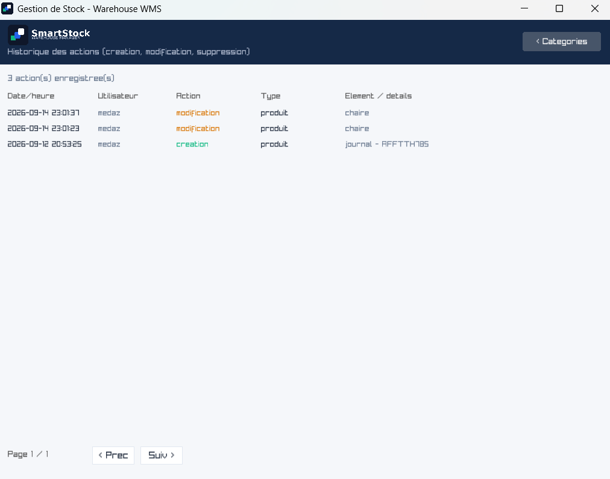 | 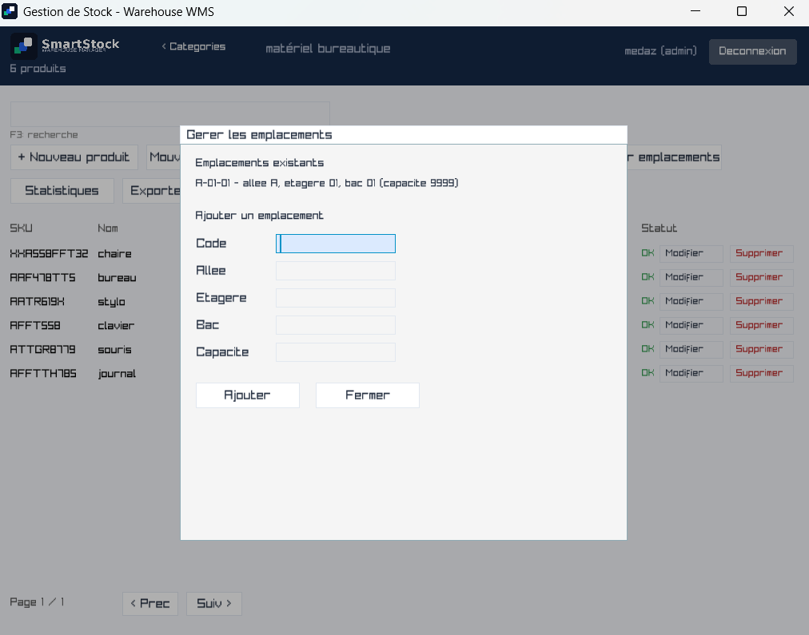 |

| Stock-taking / adjustment | Statistics (category) |
|---|---|
| 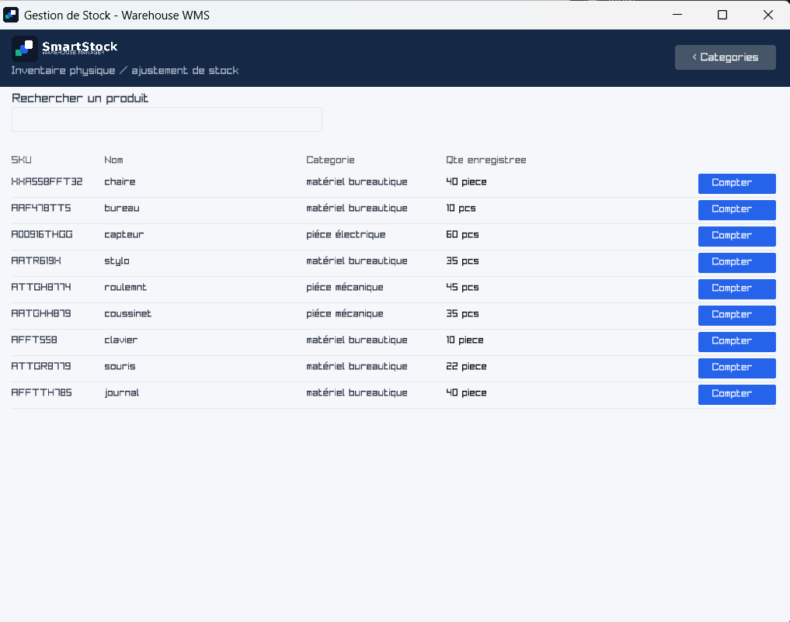 |  |

| Stock alerts dashboard | Archived products |
|---|---|
|  |  |

| Suppliers | Purchase orders |
|---|---|
| 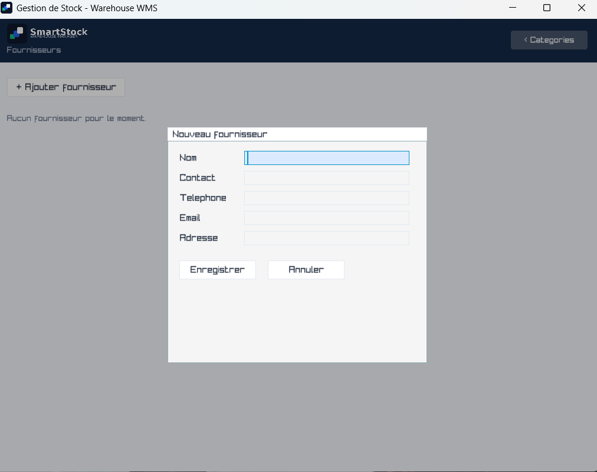 | 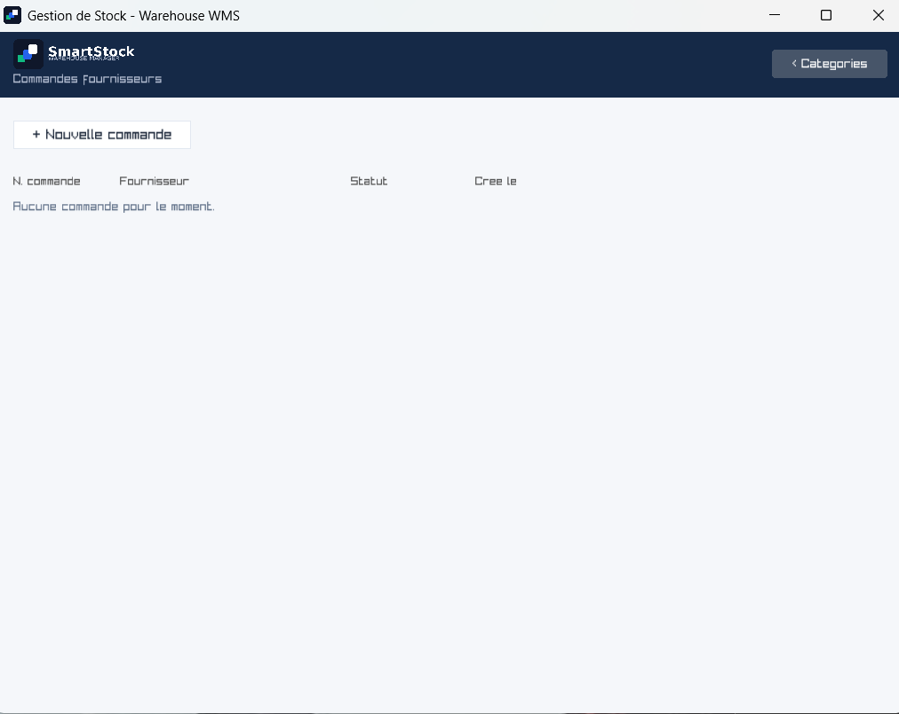 |

| Purchase order detail / receiving | Backup & restore |
|---|---|
| 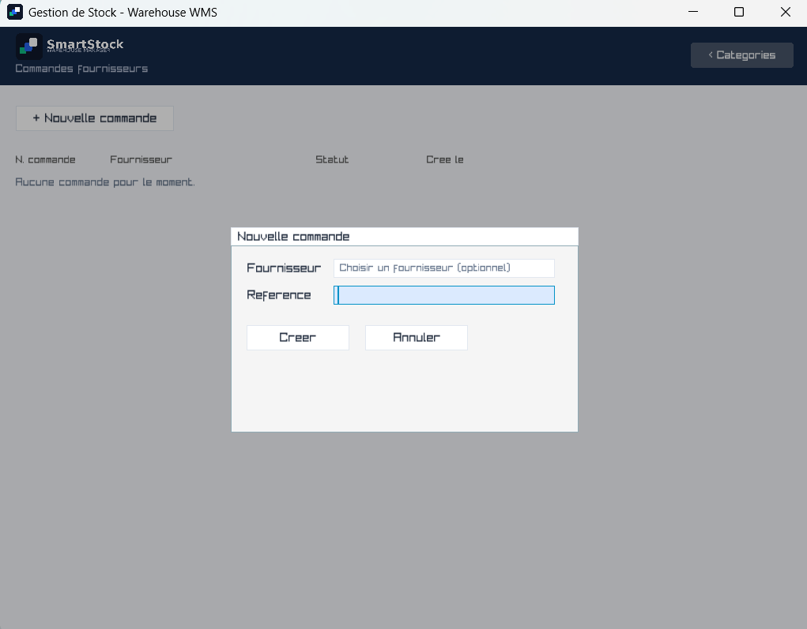 |  |

| Customers | Dispatch orders (bons de livraison) |
|---|---|
| 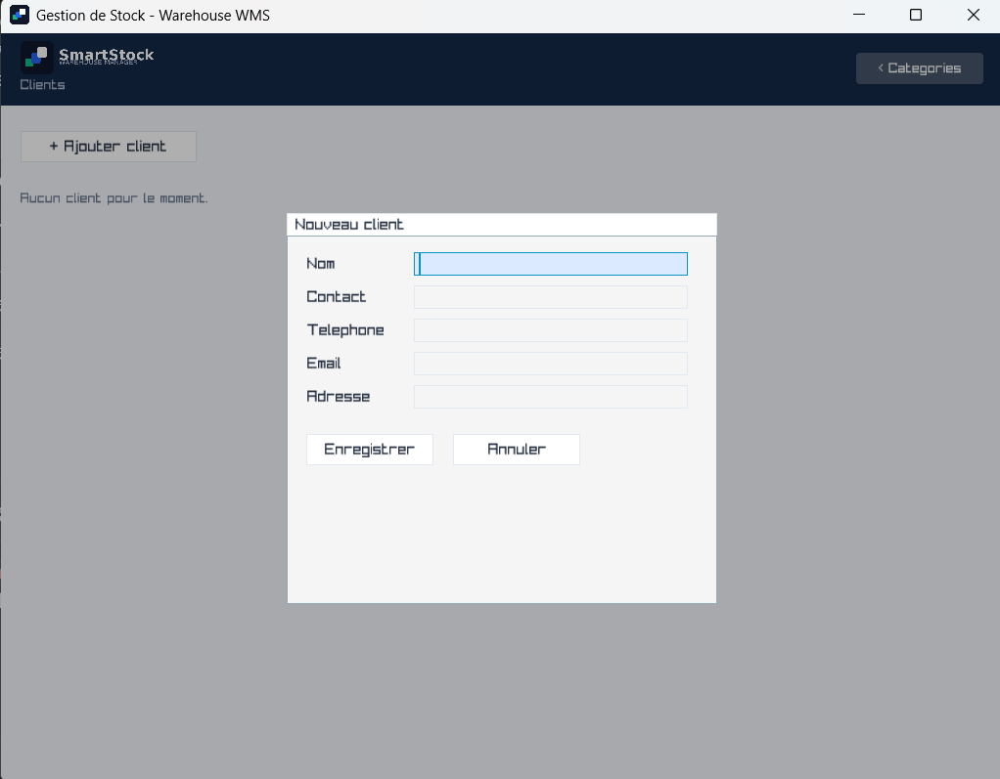 | 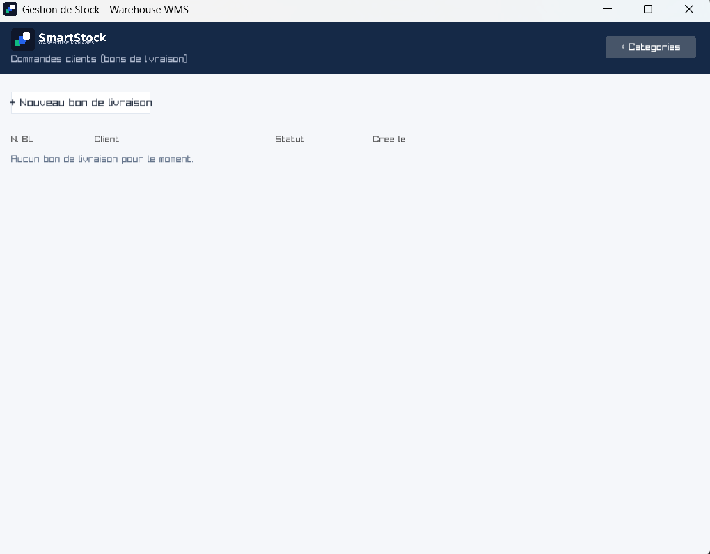 |

| Dispatch order detail / shipping | Customer returns |
|---|---|
| 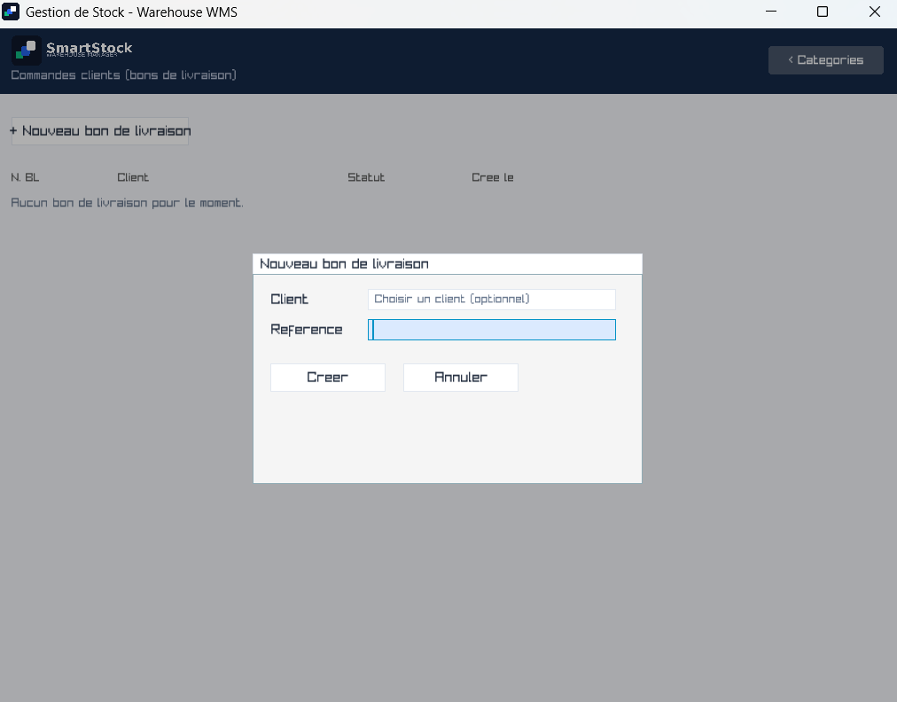 | 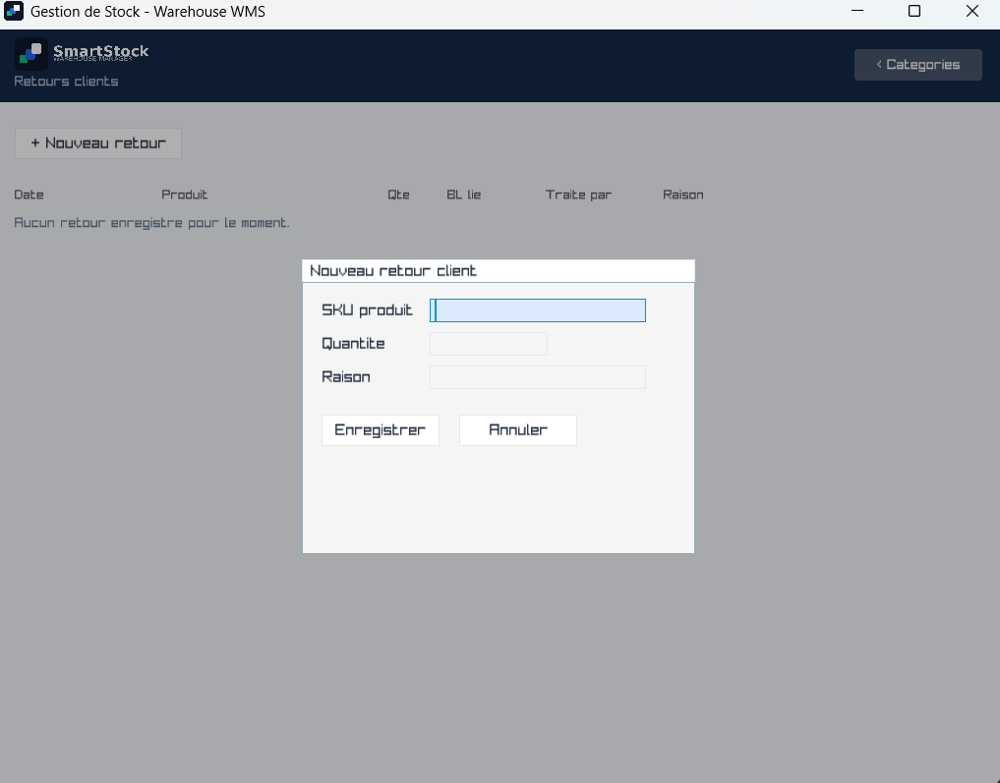 |

| Excel report (Produits + Historique) | Excel Dashboard (PivotChart + Slicer) |
|---|---|
|  | 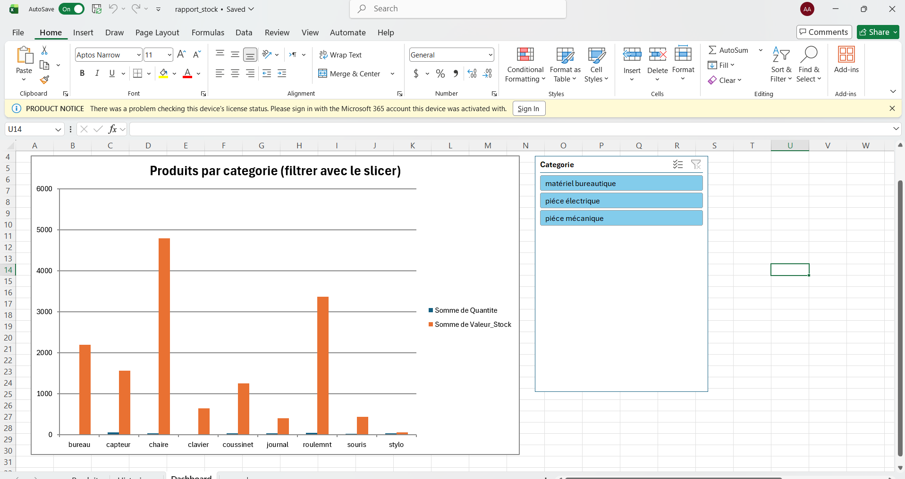 |

| PDF product sheet | User management |
|---|---|
|  |  |

---

## Features

### Authentication & sessions
- Real login/signup screens with **libsodium (`crypto_pwhash_str`, Argon2id)** password hashing — no plaintext passwords ever stored (verified directly against the live database).
- First account created automatically becomes `admin`; every account after defaults to `operateur`.
- Role-based permission gating via a single `session_can(session, "action")` check used everywhere.
- Login audit log (`login_log` table) and a 5-minute inactivity auto-lock that returns to the login screen without losing session state.
- Admin-only **"Gérer utilisateurs"** panel to promote/demote roles live, no restart required.

### Categories & products
- Categories home screen as the post-login landing page, with alphabetical listing, inline add/rename/delete, and cascade-safe deletion (refuses if active products still reference the category).
- Per-category product views with pagination, in-category and global (cross-category) search.
- Add / edit product forms with: category picker, **unit picker** (pièce / boîte / kg / litre — closed list, not free text), **brand**, **description**, **status** (`actif` / `discontinué` / `obsolète`), **barcode**, and a **supplier picker** tying a product to an entry in the suppliers directory.
- Full **input validation**: required fields, numeric format checks for prices/quantities/thresholds, negative-value rejection, and duplicate-SKU detection before it ever reaches the database.
- **Soft-delete (archiving)** instead of permanent deletion — archived products are hidden from the catalog but fully restorable from a dedicated **Produits archivés** screen, with movement history always preserved.
- Optimistic locking (`version` column) on product edits, with a clear conflict message if two users edit the same product concurrently.

### Suppliers & purchasing (inbound)
- Full supplier directory (name, contact, phone, email, address) with add/edit/delete — delete refuses if any active product still references that supplier.
- **Purchase orders**: create an order (optional supplier + reference), auto-numbered `PO-0001`, `PO-0002`, ...; add line items by SKU + quantity ordered + unit cost.
- **Receiving**: each line item can be received in full or in partial installments — receiving posts a real, atomic `MV_RECEPTION` movement through the exact same path every other stock change uses, referenced by the PO number, so it's fully visible in both audit trails.
- Purchase order status auto-tracks: `brouillon` → `commande` → `recu_partiel` / `recu`, based on how much of each line item has actually been received.

### Customers, dispatch & returns (outbound)
- Full customer directory (name, contact, phone, email, address) with add/edit/delete — delete refuses if any dispatch order already references that customer.
- **Dispatch orders (bons de livraison)**: create an order (optional customer + reference), auto-numbered `BL-0001`, `BL-0002`, ...; add line items by SKU + quantity ordered + unit price.
- **Shipping**: each line item can be shipped in full or in partial installments — shipping posts a real, atomic `MV_EXPEDITION` movement (negative delta) through the same path every stock change uses; the existing atomic "quantity can never go negative" guard automatically blocks shipping more than is in stock, with no separate stock check needed.
- Dispatch order status auto-tracks: `brouillon` → `confirmee` → `expedie_partiel` / `expedie`.
- **Returns**: a standalone log for customer returns — pick a product, quantity, and reason (optionally linked to the dispatch order it came from); posts a real `MV_RETOUR` movement that restores stock, and keeps a permanent, searchable record of every return regardless of whether it's tied to a specific order.

### Warehouse locations
- Locations (`code`, `aisle`, `shelf`, `bin`, `capacity`) are a real, first-class part of the data model — not just a hardcoded placeholder.
- **Gérer emplacements** panel to view existing locations and add new ones.
- Every stock movement (in, out, transfer, adjustment) now goes through a real **location picker** instead of the old `location_id = 1` hardcode.

### Inventory & movements
- Atomic stock movements (`inv_post_movement`) — `BEGIN IMMEDIATE` + retry/backoff, single-statement `quantity = quantity + delta` update with a `WHERE quantity + delta >= 0` guard (no read-modify-write race), audit row written in the same transaction.
- Every movement records **quantity, date/time, user, type, location, and reason** — a complete audit trail for every stock operation, inbound or outbound.
- Per-product movement history panel (**Historique**) and a **global movement audit log** screen (**Journal d'audit**) covering every movement across every product, paginated, most recent first.
- **Physical stock-taking / adjustment**: search any product, enter what you actually counted at a given location, and the app posts the correct `MV_ADJUST_POS` / `MV_ADJUST_NEG` delta automatically, with a reason — same audited, atomic path as any other movement. A zero-difference count is a safe no-op.
- Stock transfers between locations with automatic compensating rollback if the second leg fails.

### CRUD action audit log
- A **second, separate audit trail** — **Historique des actions** — distinct from the stock-movement log, covering *non-stock* actions: creating/editing/archiving/restoring products, creating/renaming/deleting categories, supplier and customer CRUD, location creation, user role changes, and purchase/dispatch order creation.
- Color-coded by action type (creation / modification / suppression / restauration), paginated, newest first, with the acting user, timestamp, and a human-readable label for each entry.
- Includes a one-time backfill on first run that reconstructs "creation" entries for every product/supplier/user/purchase-order that already existed before this feature shipped, using each table's own `created_at` timestamp (attributed to "système," since the app never recorded *who* created historical rows before this log existed — that information genuinely can't be recovered, only the creation date can).

### Dashboards & reporting
- **Statistics screens** — horizontal bar charts (product count + stock value) per category globally, and per-product charts within a single category.
- **Stock alerts dashboard** — separate "rupture de stock" (out of stock) and "stock faible" (below alert threshold) sections, each row clickable straight into its category.
- **Excel export** (via an external Python script using `openpyxl`) — full catalog or single-category reports, a **two-sheet workbook**: "Produits" (grouped by category, subtotals, styled headers, alternating rows, frozen header, autofilter) and "Historique" (every stock movement, filterable, color-coded by direction).
- **Excel Dashboard (PivotChart + Slicer)** — an optional macro-enabled template (`report_template.xlsm`) that, when opened, automatically builds a real Excel PivotTable, PivotChart, and an interactive category **Slicer** from the exported data, letting you click through categories and see the chart update live. See [setup instructions](#excel-dashboard-pivotchart--slicer-setup) below.
- **PDF product sheets** (via an external Python script using `reportlab`) — one-page info + movement-history sheet per product, styled to match the app's navy/teal palette, with header/footer bars.
- Intermediate CSVs used to feed both export pipelines are written to a scratch `exports/tmp/` folder and deleted immediately after the Python script finishes, so only the final `.xlsm`/`.pdf` files are ever visible in `exports/`.

### Backup & restore
- One-click, timestamped database backups using **SQLite's online backup API** — safe to run while the app is live.
- Restore from any existing backup file, with a confirmation step and automatic in-memory index rebuild afterward.

### UI/UX
- Custom navy/blue/teal/orange color palette applied globally via `GuiSetStyle`.
- Inter font (with French accented codepoints) loaded via `LoadFontEx`, with graceful fallback to raylib's default font.
- Branded splash screen (logo scale/fade animation), programmatic logo assets (mark + lockup, light/dark variants) used as the window icon, `.ico`, and in-app header.
- Full keyboard navigation (Tab / arrow keys / Enter) across every form, with a shared `nav_handle_focus()` helper that avoids fighting with raygui's own internal Enter handling.
- Consistent modal-blocking pattern so background clicks never leak through an open dialog.
- Toolbar buttons that wrap to a second row instead of running off-screen at narrower window sizes — applied consistently across every screen with a button row.
- Windows GUI subsystem build (`-mwindows`) — no console window appears alongside the app on launch.

---

## Tech stack

| Layer | Technology |
|---|---|
| Language | C (C11 / `gnu11`) |
| Compiler / IDE | Code::Blocks + MinGW (GNU GCC) |
| GUI | [raylib](https://www.raylib.com/) + [raygui](https://github.com/raysan5/raygui) |
| Database | SQLite (compiled in as source, not linked as a library) |
| Password hashing | [libsodium](https://libsodium.gitbook.io/doc/) (Argon2id via `crypto_pwhash_str`) |
| Fonts | Inter (Regular + SemiBold), loaded with French-accented codepoints |
| Excel export | Python 3 + [openpyxl](https://openpyxl.readthedocs.io/) (auto-installed on first run) |
| Excel dashboard | Excel VBA (macro-enabled `.xlsm` template) driving a native PivotTable/PivotChart/Slicer |
| PDF export | Python 3 + [reportlab](https://www.reportlab.com/opensource/) (auto-installed on first run) |

---

## Project structure

```
storage-wms/
├── includes/
│   ├── db.h          — WmsDb handle, Category/Location/Supplier/PurchaseOrder/
│   │                    Customer/DispatchOrder/ReturnRecord structs, all db_* declarations
│   ├── core.h         — Product/Movement structs, MovementType enum, inv_* declarations
│   ├── session.h       — Session struct, session_* declarations
│   ├── gui.h            — gui_run(WmsDb *db)
│   └── hashtable.h        — generic string-keyed hash table (SKU/barcode lookup)
├── src/
│   ├── main.c
│   ├── db/
│   │   ├── database.c   — schema, migrations, suppliers/customers/PO/BL/locations/
│   │   │                   audit_log queries
│   │   └── schema.sql
│   ├── core/
│   │   ├── session.c
│   │   ├── hashtable.c
│   │   └── inventory.c    — atomic movements, product/category CRUD, archiving,
│   │                          backup/restore, stock-take, receiving, shipping,
│   │                          returns, CSV export
│   └── gui/
│       └── main_window.c  — single file, all screens/panels (gui.c)
├── resources/
│   ├── fonts/          (Inter-Regular.ttf, Inter-SemiBold.ttf)
│   └── icons/           (app_icon.ico, logo_mark_*.png, logo_lockup_*.png, splash_screen.png)
├── python_scripts/
│   ├── export_report.py    — Excel report generator (openpyxl), fills the .xlsm template
│   ├── product_sheet.py    — PDF product sheet generator (reportlab)
│   └── templates/
│       └── report_template.xlsm   — macro-enabled template (PivotChart + Slicer dashboard)
├── lib/
│   ├── raylib/, raygui/, sqlite3/, sodium/   (each with include/ + lib/)
├── exports/                — generated Excel/PDF output (git-ignored)
│   └── tmp/                 — scratch CSVs, deleted automatically after each export
├── backups/                — generated database backups (git-ignored)
└── bin/Debug/               — build output; mirrors resources/, python_scripts/, and
                                 python_scripts/templates/ (relative paths resolve from
                                 here at runtime)
```

> **Important build convention:** every resource loaded via a relative path
> (fonts, icons, Python scripts, the `.xlsm` template) must exist in **both**
> the project root *and* `bin\Debug\`, since the compiled `.exe` runs from
> `bin\Debug` and resolves relative paths from there.

---

## Database schema

SQLite, single file (`saves/warehouse.db`), created and migrated automatically on startup.

<details>
<summary>Click to expand full schema</summary>

```sql
CREATE TABLE users (
    id            INTEGER PRIMARY KEY,
    username      TEXT UNIQUE NOT NULL,
    password_hash TEXT NOT NULL,          -- libsodium crypto_pwhash_str (Argon2id)
    role          TEXT NOT NULL CHECK(role IN ('admin','manager','operateur')),
    active        INTEGER NOT NULL DEFAULT 1,
    created_at    TEXT NOT NULL DEFAULT (datetime('now')),
    last_login_at TEXT
);

CREATE TABLE login_log (
    id INTEGER PRIMARY KEY,
    user_id INTEGER NOT NULL REFERENCES users(id),
    login_at TEXT NOT NULL DEFAULT (datetime('now')),
    logout_at TEXT,
    duration_s INTEGER
);

CREATE TABLE categories (
    id   INTEGER PRIMARY KEY,
    name TEXT UNIQUE NOT NULL COLLATE NOCASE
);

CREATE TABLE locations (
    id INTEGER PRIMARY KEY AUTOINCREMENT,
    code TEXT UNIQUE NOT NULL,
    aisle TEXT NOT NULL,
    shelf TEXT NOT NULL,
    bin TEXT NOT NULL,
    capacity INTEGER NOT NULL DEFAULT 0
);

CREATE TABLE products (
    id, prd_number, sku, barcode, name, category, category_id,
    unit, unit_price, alert_threshold, supplier_id, photo_path,
    brand, description,
    status TEXT NOT NULL DEFAULT 'actif' CHECK(status IN ('actif','discontinué','obsolète')),
    version, active, created_at, updated_at
);

CREATE TABLE stock (
    product_id, location_id, quantity,
    PRIMARY KEY (product_id, location_id)
);

CREATE TABLE movements (
    id, product_id, location_id, delta, type, reference,
    user_id, reason, created_at
);

CREATE TABLE suppliers (
    id INTEGER PRIMARY KEY,
    name TEXT NOT NULL,
    contact_name TEXT,
    phone TEXT,
    email TEXT,
    address TEXT,
    created_at TEXT NOT NULL DEFAULT (datetime('now'))
);

CREATE TABLE purchase_orders (
    id INTEGER PRIMARY KEY,
    supplier_id INTEGER REFERENCES suppliers(id),
    po_number TEXT UNIQUE NOT NULL,
    status TEXT NOT NULL DEFAULT 'brouillon',
    reference TEXT,
    created_by INTEGER REFERENCES users(id),
    created_at TEXT NOT NULL DEFAULT (datetime('now')),
    received_at TEXT
);

CREATE TABLE purchase_order_items (
    id INTEGER PRIMARY KEY,
    po_id INTEGER NOT NULL REFERENCES purchase_orders(id),
    product_id INTEGER REFERENCES products(id),
    quantity_ordered INTEGER NOT NULL,
    quantity_received INTEGER NOT NULL DEFAULT 0,
    unit_cost REAL NOT NULL DEFAULT 0
);

CREATE TABLE customers (
    id INTEGER PRIMARY KEY,
    name TEXT NOT NULL,
    contact_name TEXT,
    phone TEXT,
    email TEXT,
    address TEXT,
    created_at TEXT NOT NULL DEFAULT (datetime('now'))
);

CREATE TABLE dispatch_orders (
    id INTEGER PRIMARY KEY,
    customer_id INTEGER REFERENCES customers(id),
    do_number TEXT UNIQUE NOT NULL,       -- "BL-0001" (bon de livraison)
    status TEXT NOT NULL DEFAULT 'brouillon',
    reference TEXT,
    created_by INTEGER REFERENCES users(id),
    created_at TEXT NOT NULL DEFAULT (datetime('now')),
    shipped_at TEXT
);

CREATE TABLE dispatch_order_items (
    id INTEGER PRIMARY KEY,
    do_id INTEGER NOT NULL REFERENCES dispatch_orders(id),
    product_id INTEGER REFERENCES products(id),
    quantity_ordered INTEGER NOT NULL,
    quantity_shipped INTEGER NOT NULL DEFAULT 0,
    unit_price REAL NOT NULL DEFAULT 0
);

CREATE TABLE returns (
    id INTEGER PRIMARY KEY,
    do_id INTEGER REFERENCES dispatch_orders(id),   -- NULL if not tied to a specific order
    product_id INTEGER REFERENCES products(id),
    quantity INTEGER NOT NULL,
    reason TEXT,
    processed_by INTEGER REFERENCES users(id),
    created_at TEXT NOT NULL DEFAULT (datetime('now'))
);

CREATE TABLE audit_log (
    id INTEGER PRIMARY KEY,
    user_id INTEGER REFERENCES users(id),
    action TEXT NOT NULL,        -- 'creation','modification','suppression','restauration'
    entity_type TEXT NOT NULL,   -- 'produit','categorie','fournisseur','client',
                                  -- 'utilisateur','emplacement','commande','commande_client'
    entity_label TEXT NOT NULL,
    details TEXT,
    created_at TEXT NOT NULL DEFAULT (datetime('now'))
);
```

</details>

---

## Getting started

### Prerequisites
- Windows
- [Code::Blocks](http://www.codeblocks.org/) with the MinGW (GNU GCC) toolchain
- Python 3 on `PATH` (only required for Excel/PDF export features — see below)

### Build
1. Clone the repository.
2. Open the `.cbp` project file in Code::Blocks.
3. **Project → Build options**, set at the **project root level** (not per-target) so both Debug and Release pick up:
   - Include/library search directories for `raylib`, `raygui`, `sqlite3`, and `sodium` under `lib/`
   - Linked libraries: `raylib`, `sodium`, `winmm`, `gdi32`, `opengl32` (raylib's usual Windows link set)
   - Linker flag `-mwindows` so the app runs without a console window
4. **Build → Rebuild** (a full rebuild, not just Build, is recommended after pulling changes — stale object files have caused issues before).
5. Run from Code::Blocks or directly from `bin/Debug/<project>.exe`.

### First run
- On first launch, sign up — the first account created automatically becomes `admin`.
- The SQLite database (`saves/warehouse.db`), default location seed row, and — on the very first startup only — a one-time CRUD audit-log backfill are all created automatically.

---

## Excel & PDF export setup

Export features shell out to Python scripts via `system()`. To enable them:

1. Ensure `python` is installed and available on `PATH`.
2. Confirm `python_scripts/export_report.py` and `python_scripts/product_sheet.py` exist in **both**:
   - `storage-wms/python_scripts/` (project root)
   - `storage-wms/bin/Debug/python_scripts/` (next to the compiled `.exe`)
3. First run of each script auto-installs its dependency (`openpyxl` / `reportlab`) via `pip` — requires internet access once.
4. Generated files land in `exports/` (Excel: `rapport_stock.xlsm` or `rapport_stock_cat<id>.xlsm`; PDF: `fiche_<SKU>.pdf`). Intermediate CSVs are written to `exports/tmp/` and deleted automatically once the script finishes — they should never persist or need manual cleanup.

If an export fails, check `exports/export_log.txt` (Excel) or `exports/sheet_log.txt` (PDF) — the app redirects the Python script's stdout/stderr there for debugging, since the app itself is windowed and has no console.

---

## Excel dashboard (PivotChart + Slicer) setup

`openpyxl` cannot create native Excel PivotTables, PivotCharts, or Slicers — those require Excel's own binary structures. To get a real, interactive dashboard tab anyway, the Excel export fills data into a **macro-enabled template** (`report_template.xlsm`) that contains a `Workbook_Open` VBA macro; the macro builds a fresh PivotTable + PivotChart + category Slicer every time the exported report is opened.

**One-time setup:**
1. In Excel: **File → Options → Trust Center → Trust Center Settings → Macro Settings** → check **"Trust access to the VBA project object model."**
2. Build (or rebuild) `report_template.xlsm` — this can be done fully via PowerShell + Excel COM automation (no manual VBA editing required); see the project's setup scripts for the exact commands.
3. Place the resulting `report_template.xlsm` in **both**:
   - `storage-wms/python_scripts/templates/`
   - `storage-wms/bin/Debug/python_scripts/templates/`

**Using it:**
1. Click **Exporter Excel** in the app as usual.
2. Open the resulting `.xlsm` file.
3. Click **Enable Content** on the yellow security bar.
4. **Close and reopen the file once** — the dashboard macro only runs automatically when Excel *opens* the file, so the very first "Enable Content" click doesn't retroactively trigger it.
5. Go to the **Dashboard** tab — a bar chart and a **Catégorie** slicer should appear; clicking a category in the slicer filters the chart live.

This is a standard, safe technique (not a workaround), but it does mean the report is a macro-enabled workbook: Excel will always show a security prompt on open, and this is unavoidable with any macro-based dashboard.

---

## Roles & permissions

| Role | Typical capabilities |
|---|---|
| `operateur` | View products, post stock movements |
| `manager` | Above, plus manage products, categories, suppliers, customers, purchase/dispatch orders, stock-taking, returns |
| `admin` | Above, plus manage users, backup/restore |

All checks route through a single `session_can(session, "action")` function — there are no ad-hoc role checks scattered through the codebase.

---

## Known limitations / roadmap

- No unit tests yet on `inv_post_movement` / `inv_transfer`.
- No internationalization (Arabic/French/English) — UI text is currently French-only.
- No barcode *scanning* input yet — the `barcode` field exists on products and `inv_find_by_barcode()` is already O(1), but no dedicated "scan to search" field is wired up in the GUI yet. (Standard USB barcode scanners act as keyboard input, so this is a low-risk addition once prioritized.)
- No camera/QR-code decoding — deliberately deferred; would require new native dependencies (camera capture + barcode/QR decode libraries) that are a meaningfully bigger integration risk for a solo-maintained MinGW project than anything else in the app so far.
- No REST API/ERP sync or automated outbound low-stock alerts (the in-app dashboard exists; automated notifications don't).
- No multi-warehouse support beyond multiple locations within one database.
- Password field is plain `GuiTextBox` (not masked) — this raygui version has no built-in password box; masking would need manual bullet-character rendering.
- Editing/deleting an existing product's supplier assignment is available via the Edit form's supplier picker; there is no bulk "reassign supplier" tool across many products at once.
- Returns are currently a manual, standalone entry (pick SKU + quantity + reason) rather than driven directly from a dispatch order's line items — linking a return to its originating BL is optional metadata, not an enforced, guided workflow yet.

---

## Lessons learned

A few hard-won project-specific gotchas, kept here for anyone continuing this codebase:

- **`selected_index` (array index) as "the selected item" is fragile** — always resolve through a stable database ID (`find_product_by_id`) instead, since array indices shift across filtered/category views.
- **`category_id` and `unit` must be explicitly included in every UPDATE, not just every SELECT** — both were silently dropped from `inv_update_product`'s SQL at different points, meaning edits appeared to succeed in the UI while quietly failing to persist that one column. Any time a struct gains a field, check both the read query *and* every write query.
- **`INSERT OR IGNORE` can mask real constraint failures** — a `NOT NULL` violation was silently swallowed for a long stretch; prefer explicit error checking.
- **`sodium_init()` must run before any libsodium call** — its omission caused login verification to silently fail despite signup succeeding.
- **Hard `DELETE` on `products` is unsafe** — `movements.product_id` is a `NOT NULL` FK, so any product with movement history can never be hard-deleted; soft-delete (archiving) is the only safe pattern.
- **The "can quantity go negative" guard is reusable for both directions** — `inv_post_movement`'s existing `WHERE quantity + delta >= 0` check, built for stock receipts/removals, automatically and correctly blocks over-shipping on a dispatch order too, since a negative delta simply hits the same guard. No separate stock-availability check was needed when building outbound shipping.
- **CSV files consumed by Excel need a UTF-8 BOM** (`0xEF 0xBB 0xBF`) plus explicit `\r\n` line endings, or accented characters render as garbage.
- **`reportlab`'s `HexColor()` requires a `#` prefix** on hex strings — omitting it throws a confusing `ValueError` deep inside reportlab's own code.
- **A function must be declared/defined before its first call in the same file** — calling a function defined later in the same `.c` file causes an implicit-declaration warning and, once the real definition is reached, a conflicting-types error. Fix is to move the definition earlier, not just add a prototype.
- **A missing closing brace inside one function silently "swallows" every function defined after it** in the same file, surfacing as a confusing "invalid storage class" error on unrelated, later functions — when several consecutive functions all show this error, the real bug is almost always in whatever function comes *right before* the first one flagged.
- **PowerShell + Excel COM automation requires "Trust access to the VBA project object model" enabled in Excel's Trust Center** before any script can inject or edit VBA code — without it, `.VBProject` access throws a runtime COM exception.
- **A `Workbook_Open` macro only fires when Excel actually opens the file fresh** — clicking "Enable Content" on an already-open file does not retroactively trigger it; the file must be closed and reopened.
- **OneDrive-synced project folders can silently block file access** via cloud-only placeholders — a known Windows/OneDrive hazard worth checking if a file "isn't found" despite clearly existing.
- **Any relative-path resource must exist in both the project root and `bin/Debug/`** — the compiled `.exe` resolves relative paths from `bin/Debug`, not the project root. This applies to fonts, icons, Python scripts, and the Excel dashboard template alike.
- **Debug via file, not console** — since this is a windowed GUI app (`-mwindows`), there is no console at all; the working pattern is a temporary `fopen`/`fprintf`/`fclose` debug dump to a `.txt` file, read afterward with `type` from the command line.
- **Historical data can't be retroactively attributed to a user that was never recorded** — a CRUD audit-log backfill can reconstruct *what was created and when* from existing `created_at` columns, but never *who* did it, if that wasn't captured at the time. Be explicit in the UI (e.g. "utilisateur inconnu") rather than guessing or defaulting to a real user.
- **A well-designed atomic write function pays for itself on the second use case** — building outbound dispatch/shipping and returns took very little new logic because `inv_post_movement`'s transaction, locking, and negative-quantity guard were already generic enough to reuse unmodified for the opposite direction (money/goods leaving instead of arriving).

---

## License

*(Add your chosen license here — e.g. MIT, GPL-3.0, or "All rights reserved" if this is proprietary/client work.)*

---

<p align="center">Built with C, raylib, and a lot of debug-to-file sessions.</p>
