# SmartStock — Warehouse Management System

  

  A lightweight, native Windows desktop WMS built in C — raylib/raygui UI, SQLite storage,
  libsodium auth, and Python-powered Excel/PDF exports.

  
  
  
  
  

---

## Table of contents

- [Overview](#overview)
- [Screenshots](#screenshots)
- [Features](#features)
- [Tech stack](#tech-stack)
- [Project structure](#project-structure)
- [Database schema](#database-schema)
- [Getting started](#getting-started)
- [Excel & PDF export setup](#excel--pdf-export-setup)
- [Roles & permissions](#roles--permissions)
- [Known limitations / roadmap](#known-limitations--roadmap)
- [Lessons learned](#lessons-learned)
- [License](#license)

---

## Overview

**SmartStock** is a single-user-per-session, multi-account desktop warehouse management
application designed for small-to-medium warehouse operations (initially built for a
Tunisia/Germany deployment context). It runs as a native Windows executable — no browser,
no server, no external services required beyond an optional Python install for report
generation.

Everything — UI, business logic, and persistence — runs locally: raylib draws the interface,
SQLite (compiled in as source, not linked as a library) stores the data, and libsodium
handles password hashing. Excel and PDF reports are generated by shelling out to small,
dedicated Python scripts (`openpyxl` / `reportlab`), keeping the core app free of heavy
dependencies.

---

## Screenshots

> Replace the placeholders below with real screenshots saved into a `screenshots/` folder
> at the repository root before publishing.

| Login | Categories home |
|---|---|
| 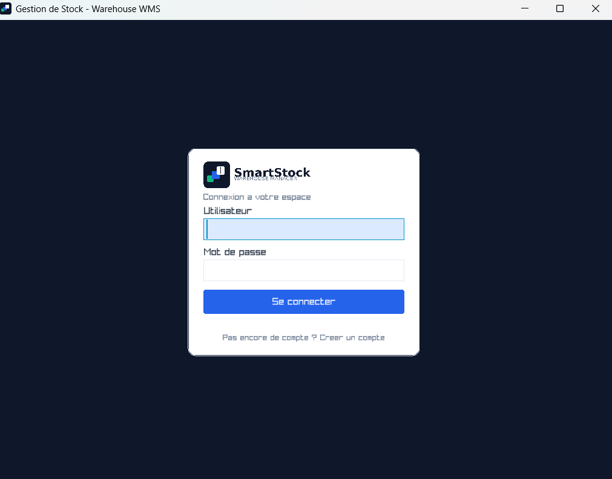 | 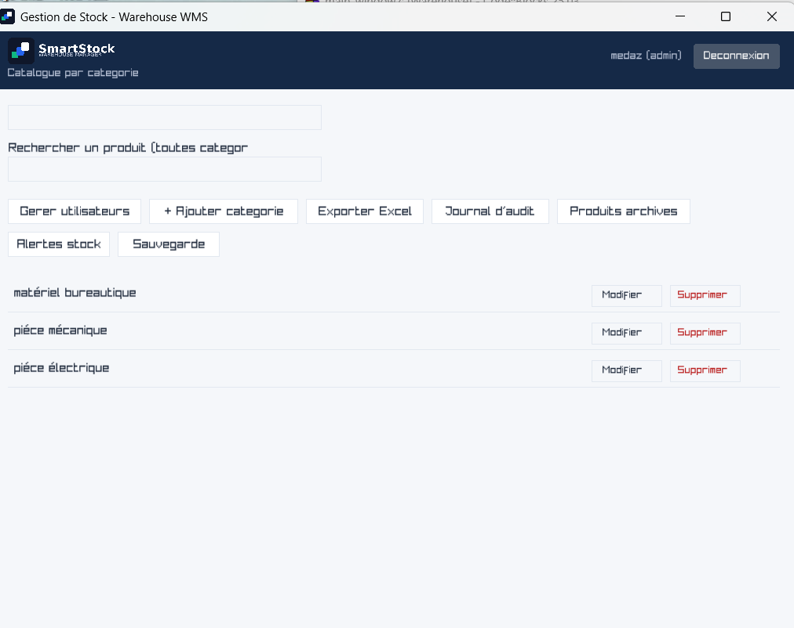 |

| Product catalog (per category) | Add / edit product |
|---|---|
| 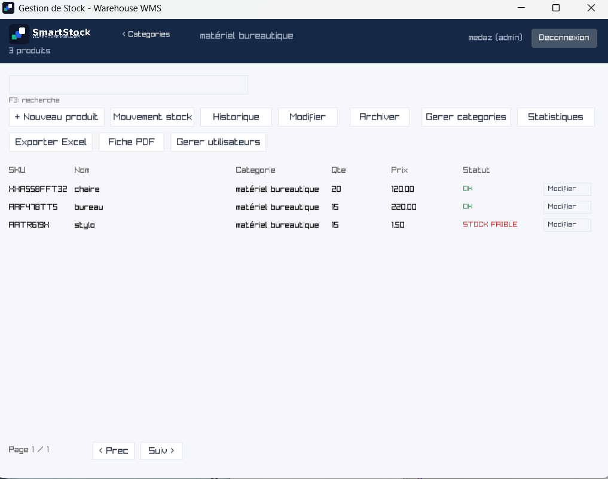 | 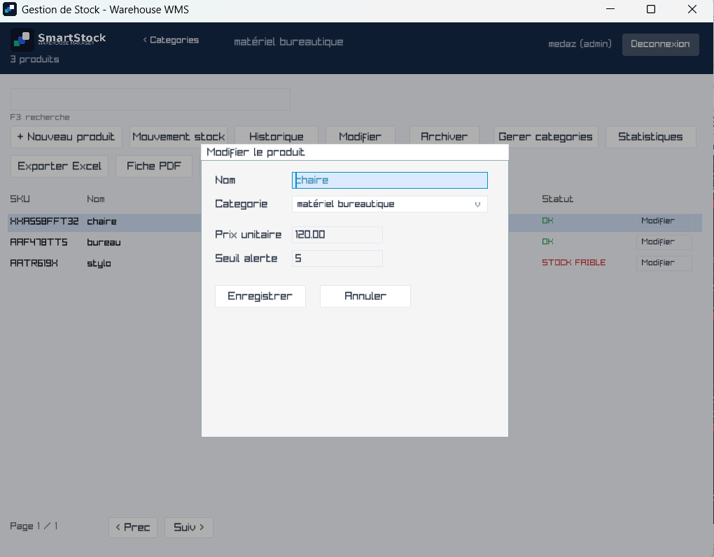 |

| Movement history | Global audit log |
|---|---|
| 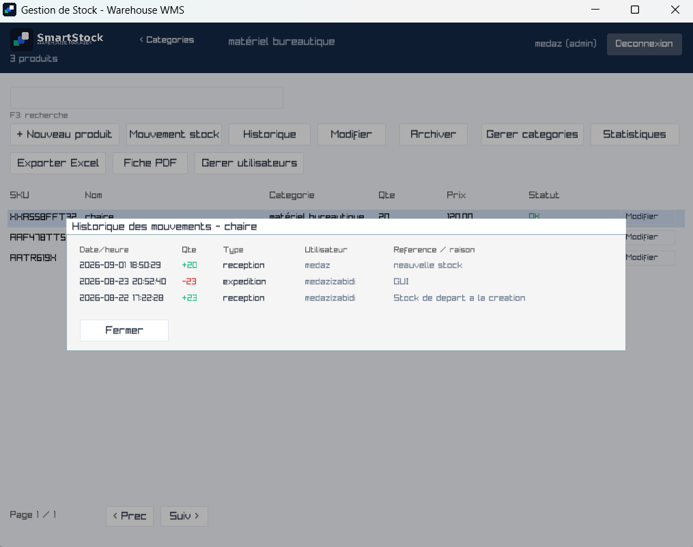 | 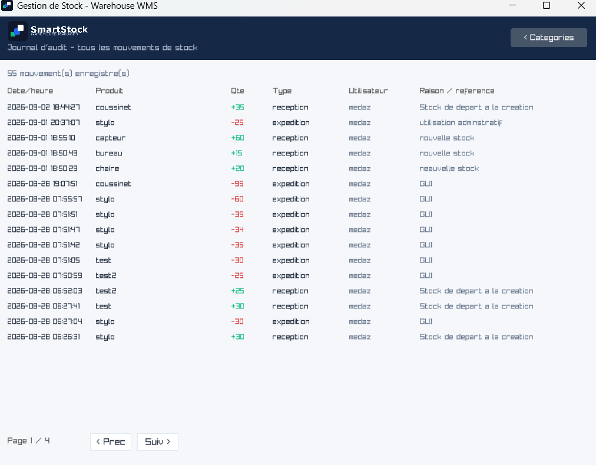 |

### Statistics

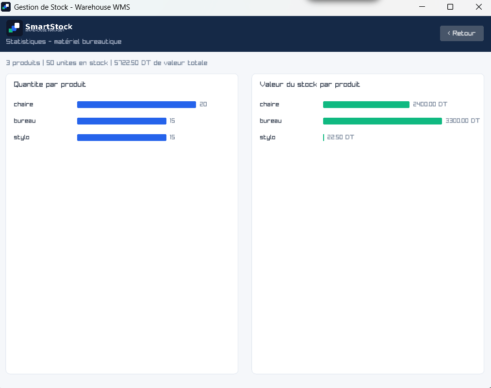

| Stock alerts dashboard | Archived products |
|---|---|
| 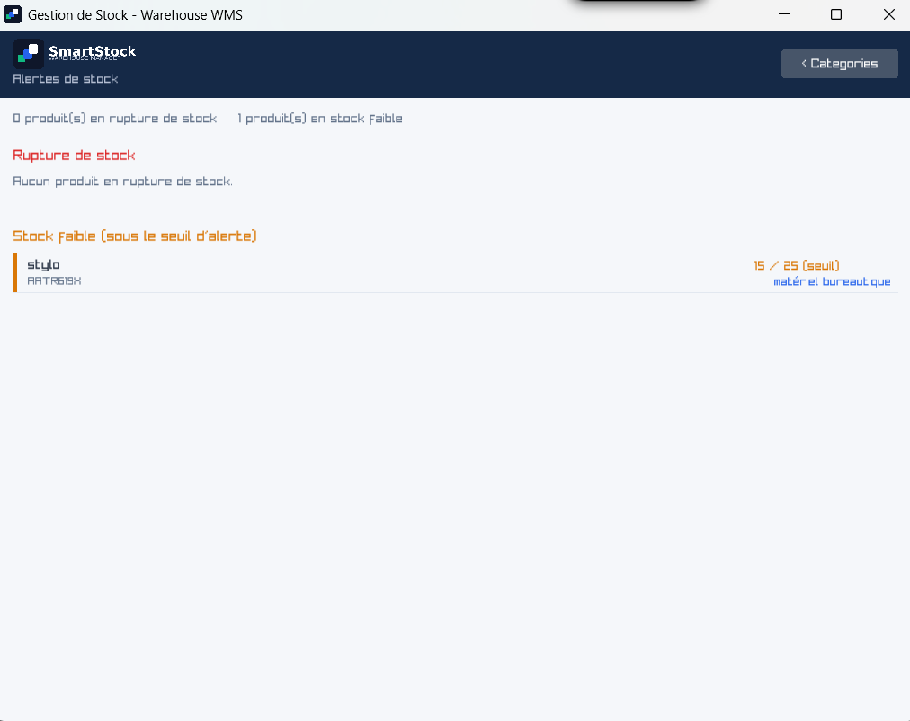 | 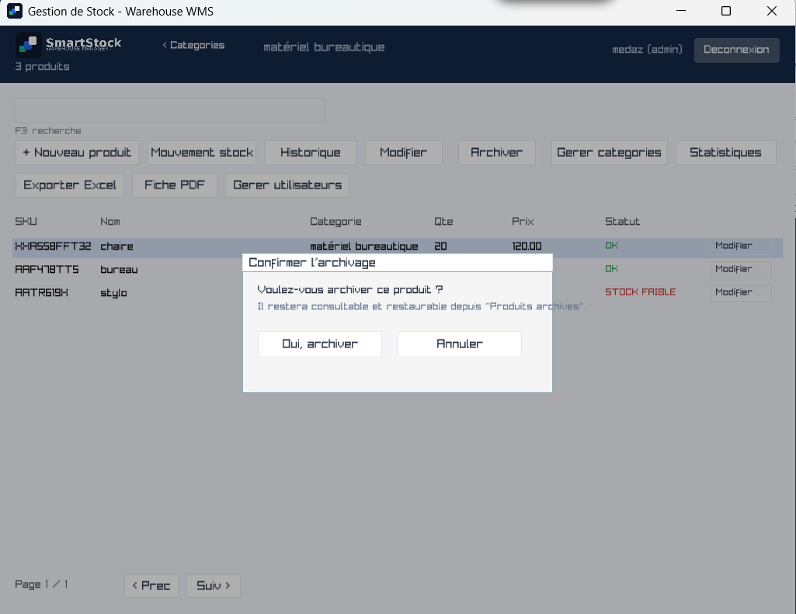 |

| Backup & restore | User management |
|---|---|
| 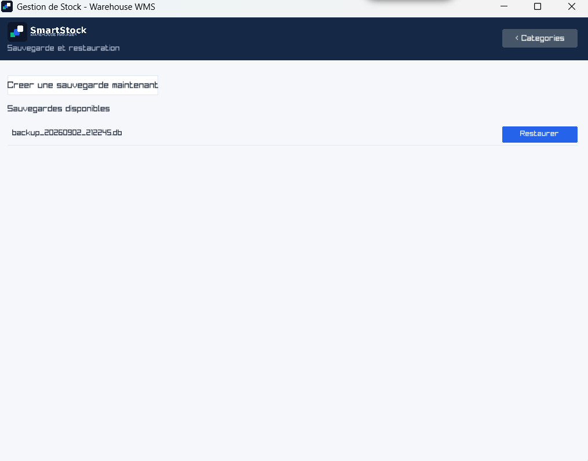 | 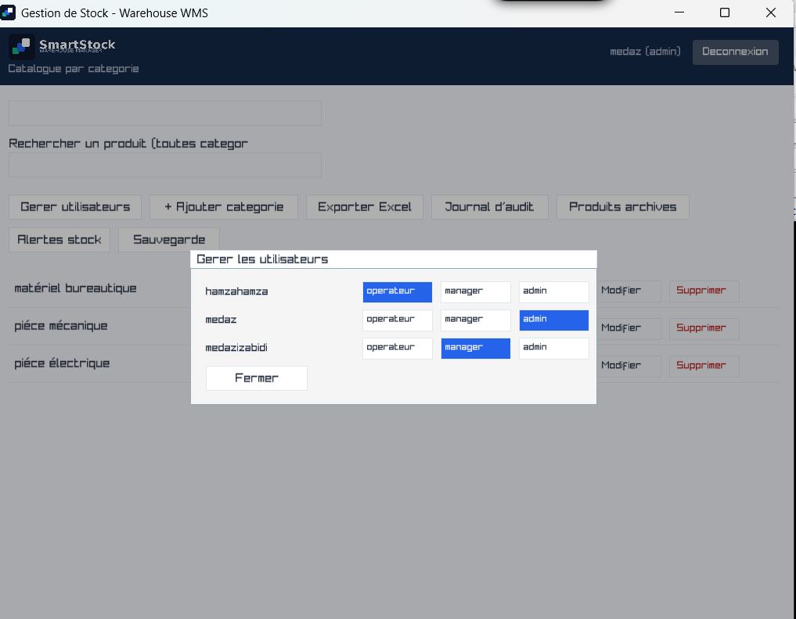 |

| Excel export output | PDF product sheet |
|---|---|
| 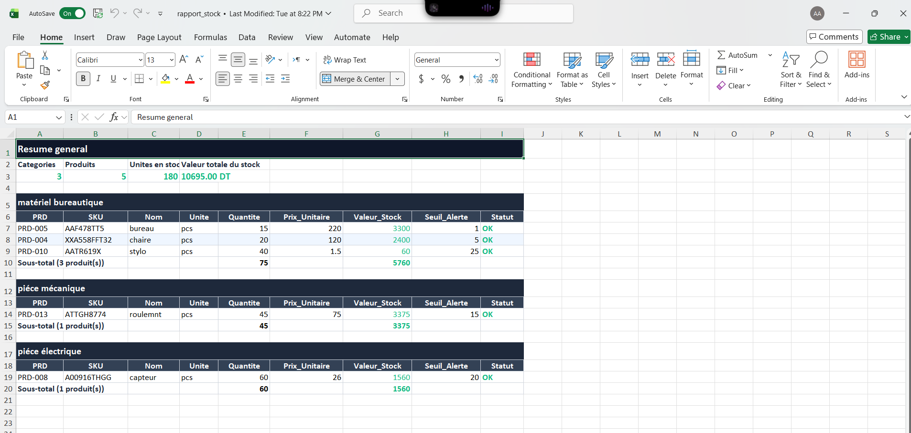 | 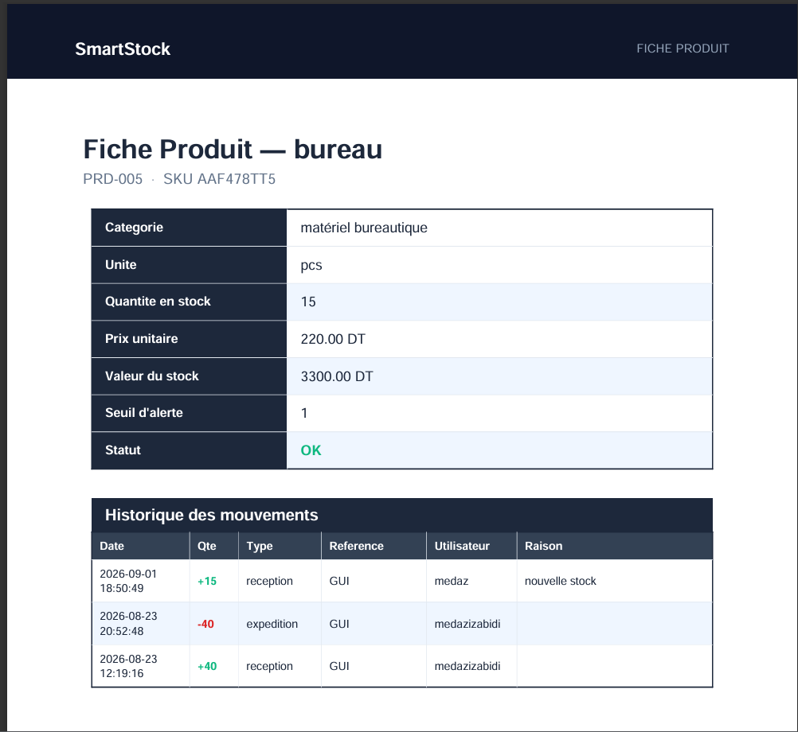 |

---

## Features

### Authentication & sessions
- Real login/signup screens with **libsodium (`crypto_pwhash_str`, Argon2id)** password hashing — no plaintext passwords ever stored.
- First account created automatically becomes `admin`; every account after defaults to `operateur`.
- Role-based permission gating via a single `session_can(session, "action")` check used everywhere.
- Login audit log (`login_log` table) and a 5-minute inactivity auto-lock that returns to the login screen without losing session state.
- Admin-only **"Gérer utilisateurs"** panel to promote/demote roles live, no restart required.

### Categories & products
- Categories home screen as the post-login landing page, with alphabetical listing, inline add/rename/delete, and cascade-safe deletion (refuses if active products still reference the category).
- Per-category product views with pagination, in-category and global (cross-category) search.
- Add / edit product forms with a real category picker (click-to-open list, not type-to-filter), initial-stock entry on creation.
- Full **input validation**: required fields, numeric format checks for prices/quantities/thresholds, negative-value rejection, and duplicate-SKU detection before it ever reaches the database.
- **Soft-delete (archiving)** instead of permanent deletion — archived products are hidden from the catalog but fully restorable from a dedicated **Produits archivés** screen, with movement history always preserved.
- Optimistic locking (`version` column) on product edits, with a clear conflict message if two users edit the same product concurrently.

### Inventory & movements
- Atomic stock movements (`inv_post_movement`) — `BEGIN IMMEDIATE` + retry/backoff, single-statement `quantity = quantity + delta` update with a `WHERE quantity + delta >= 0` guard (no read-modify-write race), audit row written in the same transaction.
- Every movement records **quantity, date/time, user, type, and reason** — a complete audit trail for every stock operation.
- Per-product movement history panel (**Historique**) and a **global audit log** screen covering every movement across every product, paginated, most recent first.
- Stock transfers between locations with automatic compensating rollback if the second leg fails.

### Dashboards & reporting
- **Statistics screens** — horizontal bar charts (product count + stock value) per category globally, and per-product charts within a single category.
- **Stock alerts dashboard** — separate "rupture de stock" (out of stock) and "stock faible" (below alert threshold) sections, each row clickable straight into its category.
- **Excel export** (via an external Python script using `openpyxl`) — full catalog or single-category reports, grouped into per-category sections with subtotals, styled headers, alternating row colors, frozen header row, and autofilter.
- **PDF product sheets** (via an external Python script using `reportlab`) — one-page info + movement-history sheet per product, styled to match the app's navy/teal palette, with header/footer bars.

### Backup & restore
- One-click, timestamped database backups using **SQLite's online backup API** — safe to run while the app is live.
- Restore from any existing backup file, with a confirmation step and automatic in-memory index rebuild afterward.

### UI/UX
- Custom navy/blue/teal color palette applied globally via `GuiSetStyle`.
- Inter font (with French accented codepoints) loaded via `LoadFontEx`, with graceful fallback to raylib's default font.
- Branded splash screen (logo scale/fade animation), programmatic logo assets (mark + lockup, light/dark variants) used as the window icon, `.ico`, and in-app header.
- Full keyboard navigation (Tab / arrow keys / Enter) across every form, with a shared `nav_handle_focus()` helper that avoids fighting with raygui's own internal Enter handling.
- Consistent modal-blocking pattern so background clicks never leak through an open dialog.
- Toolbar buttons that wrap to a second row instead of running off-screen at narrower window sizes.

---

## Tech stack

| Layer | Technology |
|---|---|
| Language | C (C11 / `gnu11`) |
| Compiler / IDE | Code::Blocks + MinGW (GNU GCC) |
| GUI | [raylib](https://www.raylib.com/) + [raygui](https://github.com/raysan5/raygui) |
| Database | SQLite (compiled in as source, not linked as a library) |
| Password hashing | [libsodium](https://libsodium.gitbook.io/doc/) (Argon2id via `crypto_pwhash_str`) |
| Fonts | Inter (Regular + SemiBold), loaded with French-accented codepoints |
| Excel export | Python 3 + [openpyxl](https://openpyxl.readthedocs.io/) (auto-installed on first run) |
| PDF export | Python 3 + [reportlab](https://www.reportlab.com/opensource/) (auto-installed on first run) |

---

## Project structure

storage-wms/
├── includes/
│   ├── db.h          — WmsDb handle, Category struct, all db_* declarations
│   ├── core.h         — Product/Movement structs, MovementType enum, inv_* declarations
│   ├── session.h       — Session struct, session_* declarations
│   ├── gui.h            — gui_run(WmsDb *db)
│   └── hashtable.h        — generic string-keyed hash table (SKU/barcode lookup)
├── src/
│   ├── main.c
│   ├── db/
│   │   ├── database.c
│   │   └── schema.sql
│   ├── core/
│   │   ├── session.c
│   │   ├── hashtable.c
│   │   └── inventory.c    — atomic movements, product/category CRUD, archiving,
│   │                          backup/restore, CSV export
│   └── gui/
│       └── main_window.c  — single file, all screens/panels (gui.c)
├── resources/
│   ├── fonts/          (Inter-Regular.ttf, Inter-SemiBold.ttf)
│   └── icons/           (app_icon.ico, logo_mark_*.png, logo_lockup_*.png, splash_screen.png)
├── python_scripts/
│   ├── export_report.py    — Excel report generator (openpyxl)
│   └── product_sheet.py    — PDF product sheet generator (reportlab)
├── lib/
│   ├── raylib/, raygui/, sqlite3/, sodium/   (each with include/ + lib/)
├── exports/                — generated Excel/PDF output (git-ignored)
├── backups/                — generated database backups (git-ignored)
└── bin/Debug/               — build output; mirrors resources/ and python_scripts/
                                 (relative paths resolve from here at runtime)

> **Important build convention:** every resource loaded via a relative path
> (fonts, icons, Python scripts) must exist in **both** the project root
> *and* `bin\Debug\`, since the compiled `.exe` runs from `bin\Debug` and
> resolves relative paths from there.

## Database schema

SQLite, single file (`saves/warehouse.db`), created and migrated automatically on startup.

Click to expand full schema

sql
CREATE TABLE users (
    id            INTEGER PRIMARY KEY,
    username      TEXT UNIQUE NOT NULL,
    password_hash TEXT NOT NULL,          -- libsodium crypto_pwhash_str (Argon2id)
    role          TEXT NOT NULL CHECK(role IN ('admin','manager','operateur')),
    active        INTEGER NOT NULL DEFAULT 1,
    created_at    TEXT NOT NULL DEFAULT (datetime('now')),
    last_login_at TEXT
);

CREATE TABLE login_log (
    id INTEGER PRIMARY KEY,
    user_id INTEGER NOT NULL REFERENCES users(id),
    login_at TEXT NOT NULL DEFAULT (datetime('now')),
    logout_at TEXT,
    duration_s INTEGER
);

CREATE TABLE categories (
    id   INTEGER PRIMARY KEY,
    name TEXT UNIQUE NOT NULL COLLATE NOCASE
);

CREATE TABLE locations (
    id INTEGER PRIMARY KEY AUTOINCREMENT,
    code TEXT UNIQUE NOT NULL,
    aisle TEXT NOT NULL,
    shelf TEXT NOT NULL,
    bin TEXT NOT NULL,
    capacity INTEGER NOT NULL DEFAULT 0
);

CREATE TABLE products (
    id, prd_number, sku, barcode, name, category, category_id,
    unit, unit_price, alert_threshold, supplier_id, photo_path,
    version, active, created_at, updated_at
);

CREATE TABLE stock (
    product_id, location_id, quantity,
    PRIMARY KEY (product_id, location_id)
);

CREATE TABLE movements (
    id, product_id, location_id, delta, type, reference,
    user_id, reason, created_at
);

## Getting started

### Prerequisites
- Windows
- [Code::Blocks](http://www.codeblocks.org/) with the MinGW (GNU GCC) toolchain
- Python 3 on `PATH` (only required for Excel/PDF export features — see below)

### Build
1. Clone the repository.
2. Open the `.cbp` project file in Code::Blocks.
3. **Project → Build options**, set at the **project root level** (not per-target) so both Debug and Release pick up:
   - Include/library search directories for `raylib`, `raygui`, `sqlite3`, and `sodium` under `lib/`
   - Linked libraries: `raylib`, `sodium`, `winmm`, `gdi32`, `opengl32` (raylib's usual Windows link set)
4. **Build → Rebuild** (a full rebuild, not just Build, is recommended after pulling changes — stale object files have caused issues before).
5. Run from Code::Blocks or directly from `bin/Debug/<project>.exe`.

### First run
- On first launch, sign up — the first account created automatically becomes `admin`.
- The SQLite database (`saves/warehouse.db`) and default location seed row are created automatically.

## Excel & PDF export setup

Export features shell out to Python scripts via `system()`. To enable them:

1. Ensure `python` is installed and available on `PATH`.
2. Confirm `python_scripts/export_report.py` and `python_scripts/product_sheet.py` exist in **both**:
   - `storage-wms/python_scripts/` (project root)
   - `storage-wms/bin/Debug/python_scripts/` (next to the compiled `.exe`)
3. First run of each script auto-installs its dependency (`openpyxl` / `reportlab`) via `pip` — requires internet access once.
4. Generated files land in `exports/` (Excel: `rapport_stock.xlsx` or `rapport_stock_cat<id>.xlsx`; PDF: `fiche_<SKU>.pdf`).

If an export fails, check `exports/export_log.txt` (Excel) or `exports/sheet_log.txt` (PDF) — the app redirects the Python script's stdout/stderr there for debugging, since the app itself is windowed and has no console.

## Roles & permissions

| Role | Typical capabilities |
|---|---|
| `operateur` | View products, post stock movements |
| `manager` | Above, plus manage products and categories |
| `admin` | Above, plus manage users, backup/restore |

All checks route through a single `session_can(session, "action")` function — there are no ad-hoc role checks scattered through the codebase.

## Known limitations / roadmap

- Movements currently hardcode `location_id = 1` — a location picker for true multi-bin support is not yet built.
- No unit tests yet on `inv_post_movement` / `inv_transfer`.
- No internationalization (Arabic/French/English) — UI text is currently French-only.
- No barcode scanning integration, REST API/ERP sync, or automated low-stock email/SMS alerts yet (the in-app dashboard exists; automated outbound alerts don't).
- No multi-warehouse support.
- Password field is plain `GuiTextBox` (not masked) — this raygui version has no built-in password box; masking would need manual bullet-character rendering.

## Lessons learned

A few hard-won project-specific gotchas, kept here for anyone continuing this codebase:

- **`selected_index` (array index) as "the selected item" is fragile** — always resolve through a stable database ID (`find_product_by_id`) instead, since array indices shift across filtered/category views.
- **`category_id` must be explicitly selected** in every product-loading query — it was silently omitted for a long time, leaving products with no category in memory despite being correctly linked in the DB.
- **`INSERT OR IGNORE` can mask real constraint failures** — a `NOT NULL` violation was silently swallowed for a long stretch; prefer explicit error checking.
- **`sodium_init()` must run before any libsodium call** — its omission caused login verification to silently fail despite signup succeeding.
- **Hard `DELETE` on `products` is unsafe** — `movements.product_id` is a `NOT NULL` FK, so any product with movement history can never be hard-deleted; soft-delete (archiving) is the only safe pattern.
- **CSV files consumed by Excel need a UTF-8 BOM** (`0xEF 0xBB 0xBF`) plus explicit `\r\n` line endings, or accented characters render as garbage.
- **`reportlab`'s `HexColor()` requires a `#` prefix** on hex strings — omitting it throws a confusing `ValueError` deep inside reportlab's own code.
- **OneDrive-synced project folders can silently block file access** via cloud-only placeholders — a known Windows/OneDrive hazard worth checking if a file "isn't found" despite clearly existing.
- **Any relative-path resource must exist in both the project root and `bin/Debug/`** — the compiled `.exe` resolves relative paths from `bin/Debug`, not the project root.
- **Debug via file, not console** — since this is a windowed GUI app, `printf` goes nowhere; the working pattern is a temporary `fopen`/`fprintf`/`fclose` debug dump to a `.txt` file, read afterward with `type` from the command line.

Built with C, raylib, and a lot of debug-to-file sessions.

